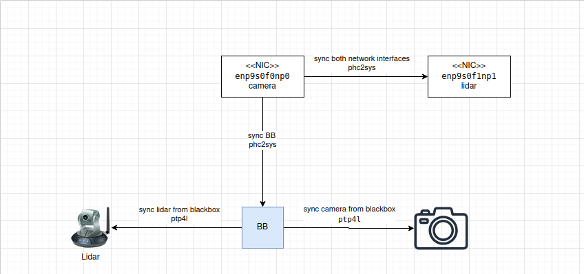
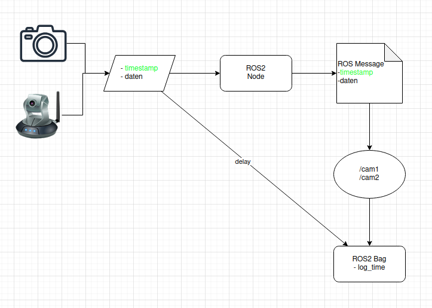

### Schematic Description

The diagram illustrates the synchronization between LiDAR and camera interfaces using Linux-based timing services.  
It shows how **PTP4L** is used for Precision Time Protocol (PTP) synchronization and how **PHC2SYS** aligns the system clock with the hardware clock.  
The schematic also highlights the role of the **BlueBox network interfaces** in distributing and maintaining accurate timing across the devices.




### Schematic Description

This diagram shows the flow of camera data and timestamps through a ROS2 pipeline. The cameras generate image data and timestamps, which are passed to a ROS2 node. The node outputs a ROS message that is published on topics like /cam1 and /cam2. Both the message stream and a delayed path are recorded in a ROS2 bag along with the log time.





### How to Run the Script (including BlueBox)

1. **Install Jupyter Lab**
   ```bash
   pip install jupyterlab
2. **Start Jupyter Lab**
    ```bash
    jupyter lab
3. **Place the script in the ROS bag directory**
    ```bash
    (e.g., rosbag_v.x/) use v2 and v5
4. **Run the script and observe the results**